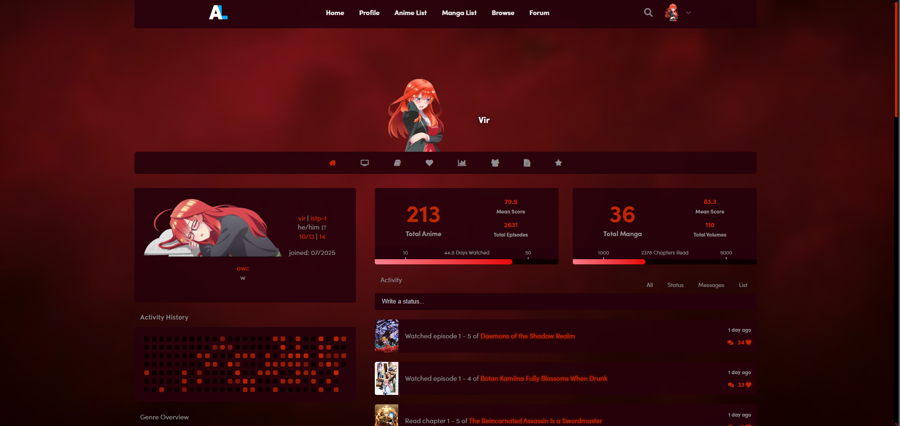

# Will eventually update the README.md and the [website](https://virenvo.github.pages/anilist-css) :D

# [Main.css](https://virenvo.github.pages/anilist-css/main.css)


```css
@import url(https://virenvo.github.io/anilist-css/main.css);
```

<sub>Got helped by Claude - I love you Claude</sub>
